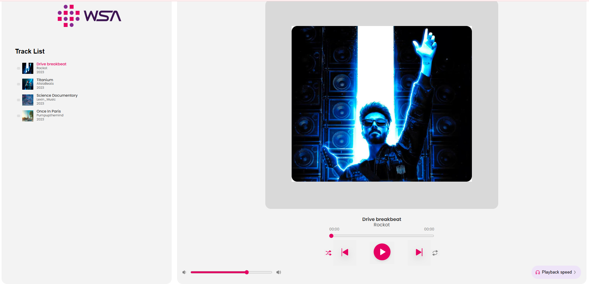
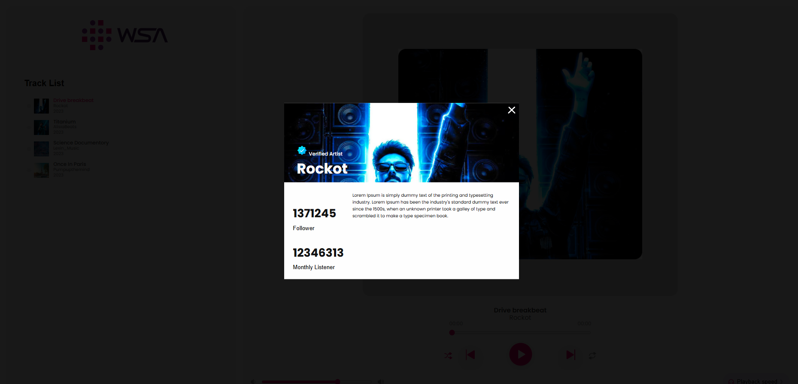
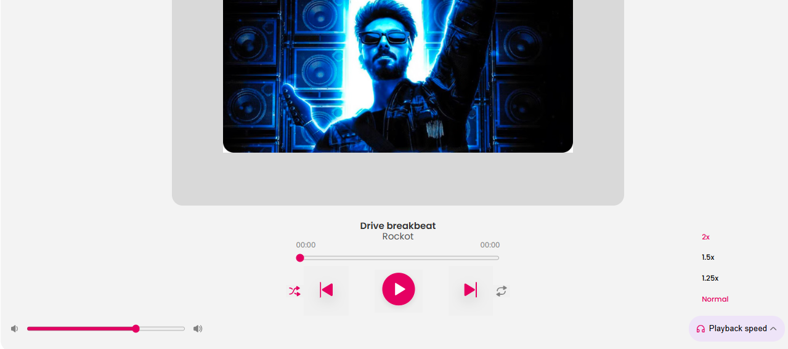

# 🎵 Advanced Music Player (Level-2)

This is an advanced version of the basic web-based Music Player. Each audio file is represented with a thumbnail that includes a title, image, and description. Clicking a thumbnail opens a pop-up with more details. The player also supports advanced playback options like speed adjustment (1.25x, 1.5x, 2x), fast forward, and fast reverse.

## ✨ Features

- 🎶 Audio thumbnails with image, title, and description  
- 🪟 Pop-up modal with additional description  
- ⏩ Fast forward and ⏪ fast reverse  
- 🕒 Adjustable playback speed (1.25x, 1.5x, 2x) via drop-down menu  
- 🧑‍💻 Clean and user-friendly UI  

## 🚀 Live Demo

## 💻 Technologies Used

- HTML5  
- CSS3  
- JavaScript (Vanilla)

## 🖼️ Project Screenshots

### 🎧 Music Thumbnails  

### 🪟 Pop-up Description  

### 🛠️ Playback Speed and Controls  

## 📁 Project Structure

<pre>
music-player/
│
├── assets/
│ ├── song1.mp3
│ ├── song2.mp3
│ └── ...
│
├── images/
│ ├── thumb1.jpg
│ ├── thumb2.jpg
│ └── ...
│
├── css/
│ └── style.css
│
├── javascript/
│ └── script.js
│
└── index.html
</pre>

## 📄 License

MIT License

Copyright (c) 2025 Tejas

Open source under the 
